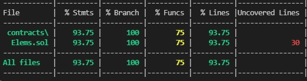

# ERC-721 Token

TOKEN_ADDRESS(Elems) = 0xf730A136cd2ee2e3749EE285D94149f30cB75e96

 - [Etherscan(Rinkeby)](https://rinkeby.etherscan.io/address/0xf730A136cd2ee2e3749EE285D94149f30cB75e96)

COLLECTION: https://testnets.opensea.io/collection/elems-v4

# Coverage

